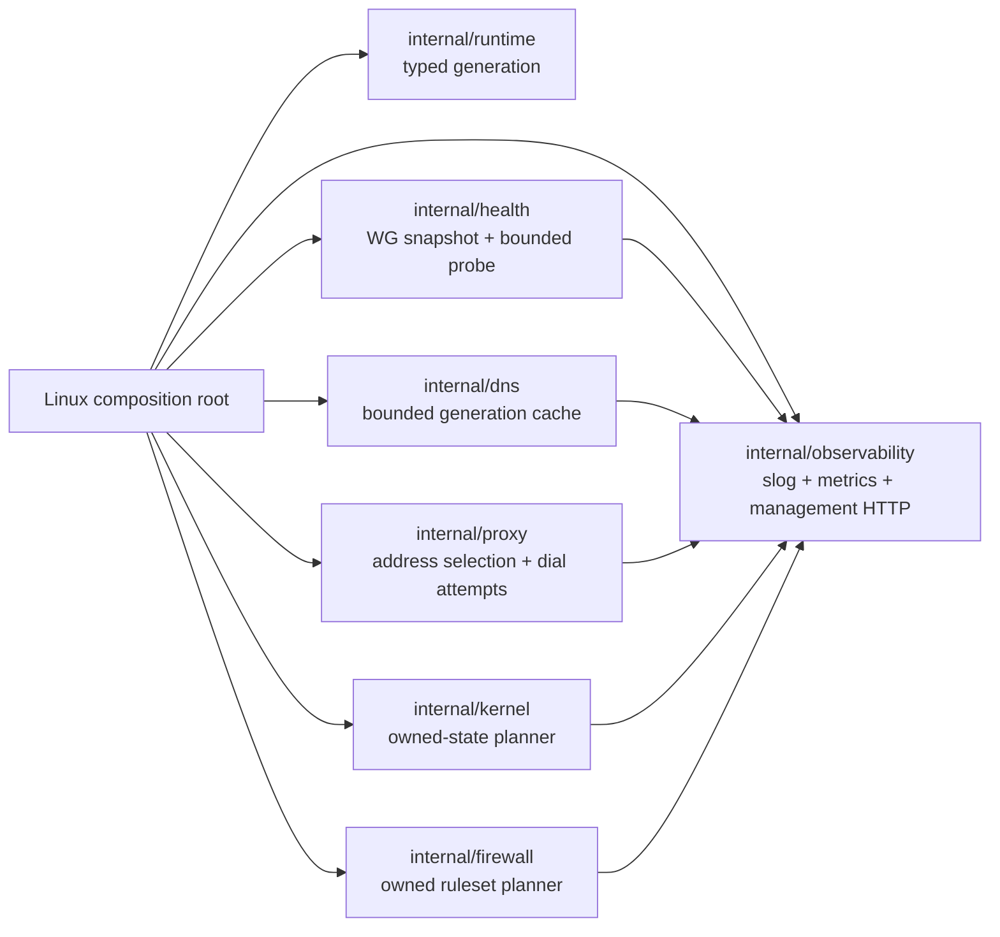

# ADR-006: Package and observability boundaries

## Status

Accepted and implemented incrementally.

## Context

The initial daemon grew as one Linux-focused `main` package. Earlier plans
introduced bounded DNS/proxy behavior and owned kernel/firewall planners, but
health still issued repeated device calls and operational evidence was spread
across plain-text logs and a reconcile file. A full rewrite or service framework
would endanger behavior already covered by integration tests.

Non-functional requirements are: no new work proportional to hostnames or peers
on the proxy data path; stable low-cardinality metrics; local-only management;
secret-safe logs/status; network-independent liveness; drift-aware readiness;
and graceful bounded shutdown.

## Decision

Extract behavior-covered packages incrementally. Consumers own narrow
interfaces. The current boundaries are:

`internal/observability` uses a dependency-free Prometheus text registry with
fixed enum normalization. Producers publish aggregates or interval snapshots;
the registry never receives request hostnames or client/destination addresses.
`internal/health` queries each unique WireGuard device once per interval,
distinguishes recent/idle-unknown/failed evidence, and publishes group policy
state. Optional active probing is a bounded primitive whose caller supplies the
marked egress dial path.

The management server is dedicated rather than sharing the CIDR-list or proxy
listeners. It defaults to loopback, sets all relevant HTTP limits, shuts down
gracefully, and exposes pprof only after explicit local-only opt-in.

## Alternatives considered

- Prometheus client library: mature collectors and histogram helpers, but adds a
  dependency and a global-registry/cardinality footgun for a small fixed metric
  set. Revisit if native histograms or collector interoperability becomes
  necessary.
- One wholesale package move: produces a cosmetically complete tree sooner but
  creates a large, difficult-to-review behavioral diff over privileged network
  lifecycle code.
- Handshake freshness as readiness: simple, but false-pages on idle peers and
  claims end-to-end health that WireGuard handshakes cannot prove.
- Per-group WireGuard queries: straightforward, but repeats kernel work when a
  tunnel participates in multiple groups.

## Consequences and trade-offs

Positive consequences are explicit ownership, testable cardinality/redaction,
correlatable generations, bounded management behavior, and one device snapshot
per interval. Operational collection stays away from the session hot path.

The root package still composes legacy Linux effects while they are extracted
one behavior-covered boundary at a time. The custom registry intentionally
supports only the metric types required here. Config-bounded names can change
series across a deployment, but untrusted traffic cannot. The active probe adds
controlled external traffic and therefore remains disabled by default.

## Failure modes and mitigations

- Management exposure: config rejects wildcard/non-loopback TCP and pprof is
  opt-in; Unix socket paths must be absolute.
- Metric explosion: enum normalization occurs before storage and a thousand-
  identity cardinality test guards the contract.
- Secret leakage: one redacting slog handler and redacted status errors are
  covered by tests.
- Probe amplification: interval, timeout, jitter, and concurrency are bounded;
  the destination is configured independently of customer traffic.
- Health query load: immutable interval snapshots are shared by every group.
- Shutdown hangs: the management server has a shutdown deadline and falls back
  to close; proxy sessions retain their separate configured drain limit.
